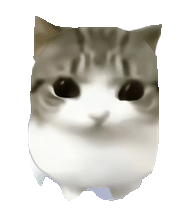

# 月薪喵 Codex Pet

<p align="center">
  
</p>

<p align="center">一个可直接加载到 Codex Desktop 的原创桌面宠物包。</p>

<p align="center">
  <a href="https://kanadek.github.io/yuexin-miao-codex-pet/">动画预览</a> |
  <a href="https://learn.chatgpt.com/docs/pets">Codex Pets 官方说明</a> |
  <a href="NOTICE.md">版权与来源说明</a>
</p>

## 安装

[在 Codex 中安装月薪喵](codex://pets/install?name=%E6%9C%88%E8%96%AA%E5%96%B5&imageUrl=https%3A%2F%2Fraw.githubusercontent.com%2FKanadeK%2Fyuexin-miao-codex-pet%2Fmain%2Fpet%2Fspritesheet.webp&spriteVersionNumber=2)

如果浏览器不允许打开 `codex://` 链接，可使用下列脚本或手动安装。

### Windows PowerShell

```powershell
irm https://raw.githubusercontent.com/KanadeK/yuexin-miao-codex-pet/main/scripts/install.ps1 | iex
```

### macOS / Linux

```bash
curl -fsSL https://raw.githubusercontent.com/KanadeK/yuexin-miao-codex-pet/main/scripts/install.sh | sh
```

安装器会校验 SHA-256。已有同 ID 宠物会先备份到 `~/.codex/pet-backups/`，不会直接删除。

### 手动安装

把 `pet/pet.json` 与 `pet/spritesheet.webp` 放入 `~/.codex/pets/yuexin-miao/`，然后在 **Settings > Pets** 中刷新并选择 **月薪喵**。使用 `/pet` 或 **Wake Pet** 唤醒她。

## 九种动作

| Codex 状态 | 动画 |
| --- | --- |
| 空闲陪伴 |  |
| 向右奔跑 |  |
| 向左奔跑 |  |
| 挥手问候 |  |
| 开心跳跃 |  |
| 任务受阻 |  |
| 等你回复 |  |
| 忙碌工作 |  |
| 等你验收 |  |

## 官方格式

- 图集：`1536 × 1872` lossless WebP
- 网格：`8 × 9`，单格：`192 × 208`
- 背景：透明 RGBA；Sprite 版本：`2`
- 文件大小：小于官方 20 MiB 上传限制

`scripts/validate_pet.py` 会逐格检查已用帧、空白帧、透明度、尺寸、文件类型和元数据。

## 从源码构建

```powershell
uv venv .venv
uv pip install --python .venv\Scripts\python.exe -r requirements-dev.txt
.venv\Scripts\python.exe scripts\build_assets.py
.venv\Scripts\python.exe scripts\validate_pet.py
.venv\Scripts\python.exe -m pytest -q
```

macOS / Linux 将 Python 路径改为 `.venv/bin/python`。

## 素材来源与版权

- 用户提供的参考图只用于理解“可爱小猫助手”的抽象需求，未被分发、临摹或作为生成输入。
- 月薪喵是全新设计：橘奶油毛色、弯月眉斑、琥珀菱形眼、青绿色领巾与铃铛、双色尾环。
- 角色板由 OpenAI 内置图像生成工具依原创提示词生成；背景由本地图像处理去除。
- 动作帧、图集、GIF 和校验和均由仓库脚本生成；没有复制任何第三方素材、脚本或 Git 历史。

完整生成提示词见 [artwork/PROMPT.md](artwork/PROMPT.md)，版权边界见 [NOTICE.md](NOTICE.md)。

## 贡献者

首个公开版本由 [KanadeK](https://github.com/KanadeK) 提交和发布。项目没有添加自动生成的 `Co-authored-by` 条目，也没有继承其他仓库的 Git 历史。完整名单见 [AUTHORS.md](AUTHORS.md)。

## License

Original code, documentation, and artwork are released under the [MIT License](LICENSE). See [NOTICE.md](NOTICE.md) for scope and third-party trademark information.
